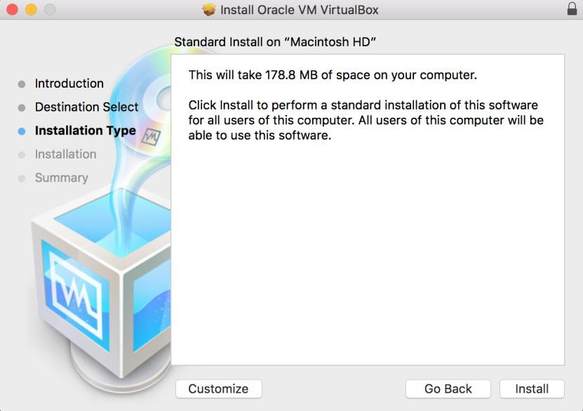
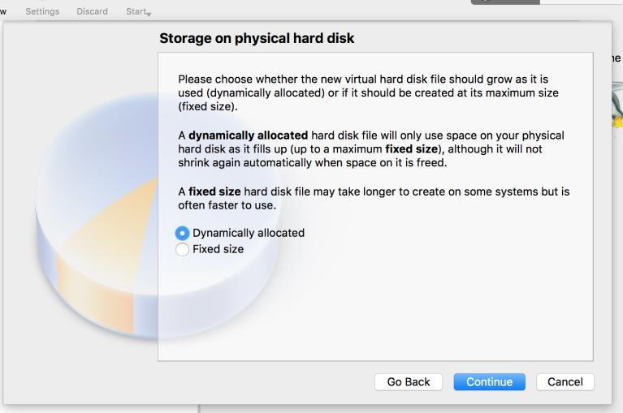
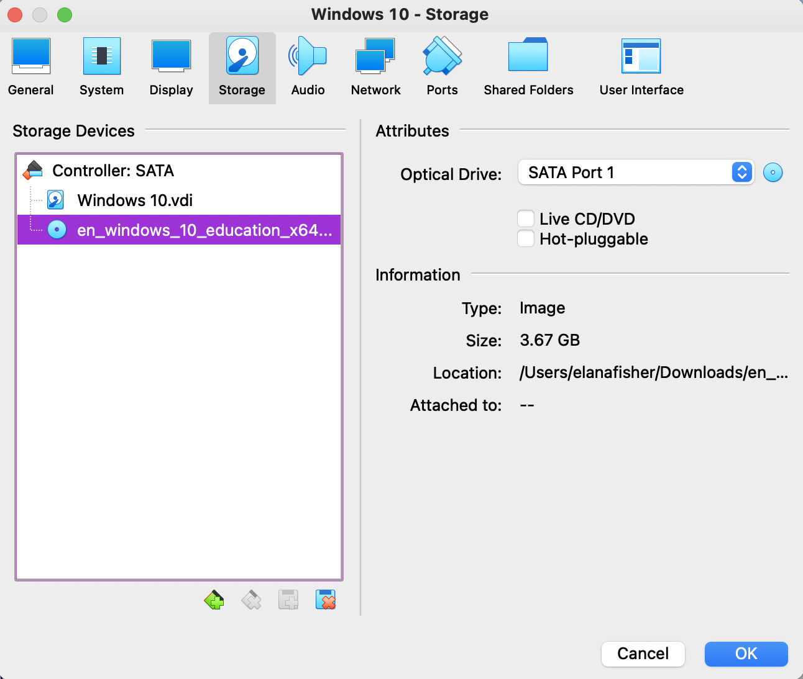

# Installation guide for Virtualbox and Windows 10 on MacOS machines

## System Requirements

- MacOS (Do not attempt anything in this document unless you are using a Mac computer)
- 4 GB RAM
- 20+ GB of free space on your hard drive

In order to install all software requirements for the course with ~2 GB for course files, you need approximately 20 GB of disk space available. To achieve this *minimal install* you need to delete all files that end in `.iso` or `.exe` after they have been installed successfully.

## Step 1: Download pre-requisite software packages

- Navigate to the course page for OMIS 105 on Camino
- Download all 4 files that are provided by a Google Drive link
  - Note: Only the Windows 10 `en_windows(...).iso` is required for this installation document.
- Navigate to the website for [VirtualBox](https://www.virtualbox.org/)
- Click the large *Download VirtualBox 6.x* button

- On the following page, click the link labeled *OS X hosts* and save the `.dmg` file where you can find it again.
- Alternatively, you can just follow [this link](https://download.virtualbox.org/virtualbox/6.1.22/VirtualBox-6.1.22-144080-OSX.dmg) directly. Although, it may be broken or not point to the newest version of VirtualBox when you read this.

## Step 2: Installing VirtualBox

- Find the `.dmg` file you just downloaded (likely in `Downloads` by default with most browsers)
- Double-click this file which will open a window that looks like this:

- Double-click the icon shown under *1.* that is labeled `VirtualBox.pkg`
- Click *Install for all users on this computer*

- Click install on the next screen to confirm you would like to install VirtualBox

- Wait for the install to finish, this could take a few minutes to complete.
  - **IF YOUR INSTALL FAILS** Please see the *Common Problems* section at the bottom of this document.

## Step 3: Creating a Virtual Machine (VM)

- Navigate to your `Applications` folder and double-click the VirtualBox application icon.
  - This should open a window labeled *Oracle VM VirtualBox Manager*
- Click the blue "circle-star" labeled *New* in the top-left corner of the application to create a new virtual machine

- Name your virtual machine
  - This can be anything, but if you type *Windows 10*, the application will automatically populate the type and version fields correctly.
- Specify *Microsoft Windows* for the type and *Windows 10 (64-bit)* for the version.

- On the following screen, select the amount of system memory you would like to allocate.
  - This will take memory away from your normal OSX system and give it to the Windows 10 VM, so the more memory (RAM) you allocate, the better the performance of your VM will be.
  - Start with a quarter of your available RAM and move this value up as you see fit. 
  - Picking a value that is too high can lead to system instability or crashes, stay out of the region that is red in this window at all times.

- Once you have selected a value, click *Continue*
- On the next screen, ensure that *Create a virtual hard disk now* is selected and click create

- On the following screen, select *VDI (VirtualBox Disk Image)* and click *Continue*

- On the following screen, select *Dynamically allocated* and click *Continue*
  - This makes it such that your virtual hard drive will only occupy as much room as it needs on your system, rather that constantly occupying the size you select on the next screen

- Next, select an upper limit for the size of this disk. 30 GB should be safe, but there's no harm in going higher if you aren't going to occupy that much space.

- Now it's time to start your new virtual machine.
- To start the VM, simply click the "Start" button.

- This *should* generate a prompt for you to provide the `.iso` file you downloaded earlier.
  - The operating system can't be installed without providing it with media to install from.
    - In the past, this involved inserting the Windows install CD into your computer. Therefore we need to provide the `.iso` file as a *virtual CD*.

- For some students, this prompt would not show up and then generate an error message when starting the VM.
- If this is the case, you must go click the "Settings" button.
- Navigate to the "Storage" tab.
- Then there should be a blue disk icon with the word "Empty" next to it, click this icon.
- Then on the right side of the window, under the "Attributes" heading, there is another *blue disk icon*. Click this and select "Choose a disk file" and select the `.iso` that is *likely* in your Downloads folder.
- After this, the VM should start normally and you will be able to follow the steps below.
  - If you encounter an error at this point or anywhere else, check the **Common Issues** section below.

- Click "Next" with all the default values
- Click "Install now"
- When asked to enter your product key, press skip. This will be entered later in the process.
- Click "I agree" check-box and click "Next".
- Select "Custom: Install Windows only (advanced)"
  - This may not appear for everyone.
- Click "Next" while ensuring that the *X* GB hard drive you defined earlier is selected.
  - It should be, but it is important to check.
- Select "Do this later" when prompted for your product key.
  - Once again, this will be done later in the process.
- Click "Customize settings" and turn all sliders to "Off" except for the one that begins "Use SmartScreen online services..." so the pages look like the following images.
- Select "Join a local Active Directory domain."
- Select a username and password for your VM, make sure you can remember this or write it down.
- If prompted on boot with this message, select "No."
- Now shut the VM down, either by clicking the *X* in the corner of the window or through the Windows menu in the bottom left corner of the screen.
  - If the former, ensure that you select "shut down" when prompted.

## Alter Virtual Machine Boot Order
- Click "Settings"
- Navigate to the "System" tab
- Deselect all options except for "Hard Disk" from the boot order menu
- Click OK
- Start VM again by clicking the "Start" button
Now that the Operating System has been fully installed, there is no longer a need for this *virtual CD* you *inserted* before.

## Activating Windows
- Start your VM
- Click the Windows start menu in the bottom left corner of the screen
- Click the "Settings" gear icon
- Select "Update and Security"
- Select "Activation"
- Click "Change product key" and enter the product key provided by your professor

## Updating Windows
In order to install some software required later in the quarter, your Windows version must be greater than 1607 to install it. This does not need to be done in the order of this document, but it must be done before installing SSMS.
- Follow the instructions of the previous section until you get to "Update and Security".
- Then on this tab, you should see a button that says "Check for Updates," and let Windows install all necessary updates.
- 

## Create Shared Folder (Optional)
As the name implies, setting up a shared folder allows you to share files directly between the Windows VM and your normal MacOS system. If you choose not to do this, you would need to download any new software from inside the VM in a browser and use Google Drive, email, etc. to transfer files out of the VM.
- Create a folder *somewhere* in MacOS to use as your shared folder.
  - A folder within Downloads is probably a good spot.
-

